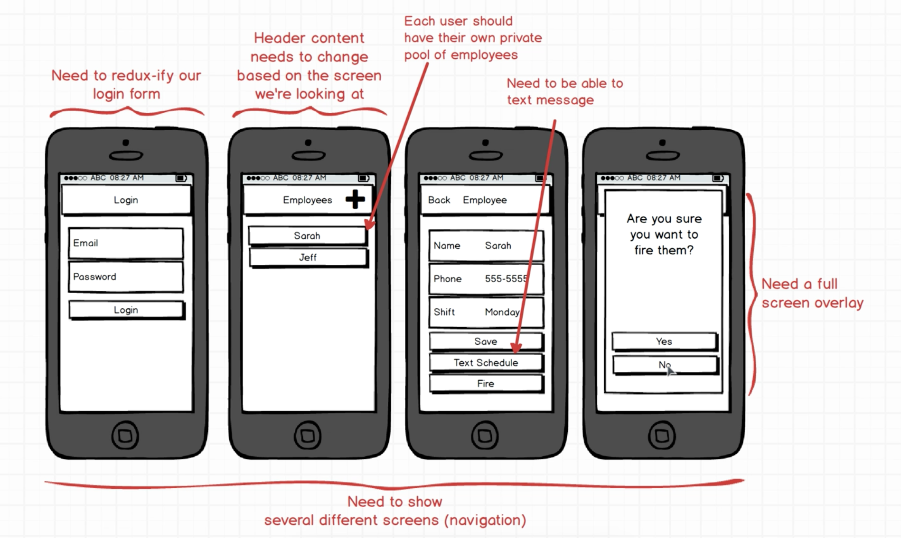

# Manager, Udemy tutorial
Simple app, following Udemy [The Complete React Native and Redux Course](https://www.udemy.com/the-complete-react-native-and-redux-course/learn/v4/content)
## Main Goal
Getting started with Redux, and going towards production level usage of Redux with React Native. 
With this project, I've gained a solid experience with Redux and Firebase, and it will definitely help me in future projects. Note, the app might not have super rich UI because the intention is keeping it simple while learning about Redux and focusing on integration.
## Demo


### [Demo - Try it on Expo]()


## Getting started

```
git clone https://github.com/jkhusanov/manager-udemy.git

exp start

exp ios


```

### TODO

- [x] Design & build an Intro Screen
- [x] Navigation
  - [x] Connect it to Redux  and Firebase - login, error
- [x] Employee create form screen
  - [x] Connect it to Redux and Firebase -push
- [x] Design & build EmployeeList Screen
  - [x] Connect it to Redux and Firebase - fetch employees
- [x] Code reuse for Edit Employee
- [x] Implement text employees their schedule feature
- [x] Implement fire an employee feature
- [x] Attach screenshots/gif of screens to `README.MD`

### Wireframe
<div style={{display: flex; flex-direction: row}}>
  
</div>
